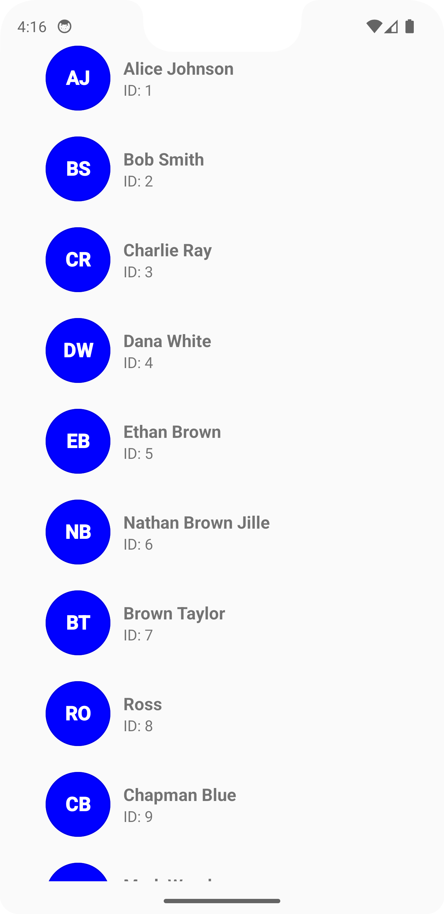

# 🖼️ TextDrawable – Android Custom Text Drawable Library

A lightweight Android library to create custom drawables with initials or text – perfect for contact icons, user profiles, or fallback avatars.

---

## ✨ Features

- Create circular, rectangular, or rounded rectangle shapes
- Customize font, size, color, border, and text casing
- Automatically extract initials from names (e.g., `"John Doe"` → `"JD"`)
- Easy-to-use builder pattern for configuration
- Perfect as placeholder avatars or initials for contacts

---

## 📸 Screenshots

<p float="left">
  
</p>

---

## ⚙️ Usage Example

```text
val drawable = ContactTextDrawable.builder()
    .beginConfig()
    .width(100)
    .height(100)
    .textColor(Color.WHITE)
    .withBorder(4)
    .fontSize(30)
    .bold()
    .toUpperCase()
    .endConfig()
    .buildRound("John Doe", Color.BLUE)

imageView.setImageDrawable(drawable)
